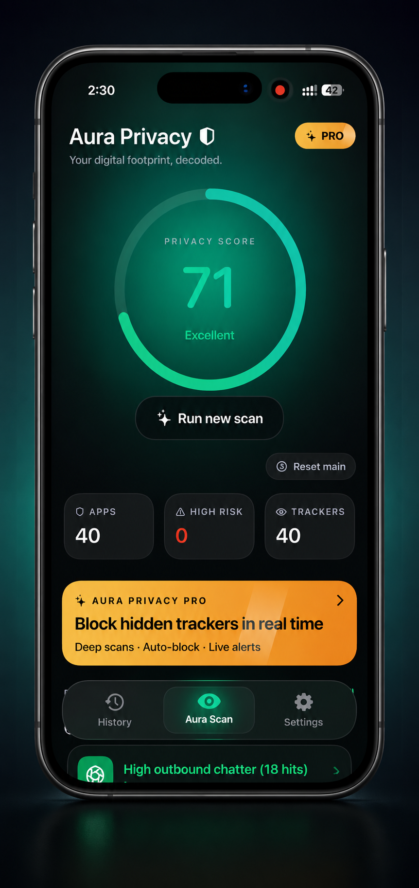
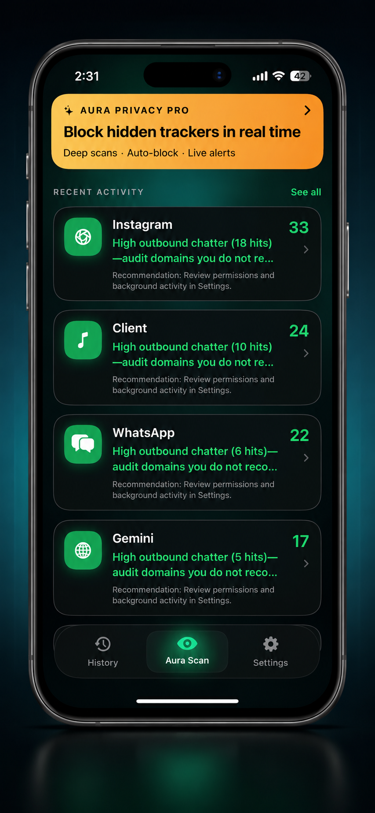
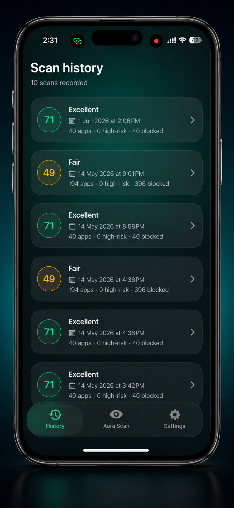
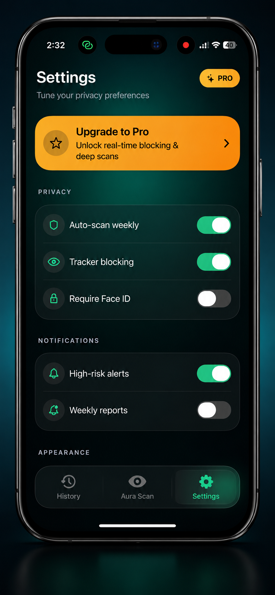
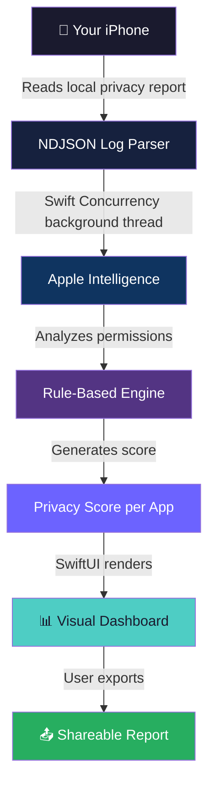

<div align="center">

<!-- Animated Header -->


<!-- App Icon Placeholder -->
<br/>

<!-- Animated Typing -->
<a href="https://github.com/Amansaini-11/AuraPrivacy">
  
</a>

<br/><br/>

<!-- Badges Row 1 -->


<!-- Badges Row 2 -->


<br/>

<!-- License & Stars -->


</div>

---

<div align="center">

## 🔐 What is Aura Privacy?

</div>

> **Aura Privacy** is an on-device iOS privacy auditor powered by **Apple Intelligence**. It reads your iPhone's local app privacy reports and tells you exactly which apps have been accessing your **microphone**, **camera**, **location**, and more — even in the background, even when you didn't know.
>
> **No internet required. No account needed. No data ever leaves your device. Ever.**

---

<div align="center">

## ✨ Features

</div>

<table align="center">
  <tr>
    <td align="center" width="200">
      <h3>🤖</h3>
      <b>Apple Intelligence</b><br/>
      <sub>On-device AI parses your iOS privacy reports automatically</sub>
    </td>
    <td align="center" width="200">
      <h3>📴</h3>
      <b>100% Offline</b><br/>
      <sub>Works without internet. Nothing is uploaded. Nothing is stored remotely.</sub>
    </td>
    <td align="center" width="200">
      <h3>⚡</h3>
      <b>2-Second Processing</b><br/>
      <sub>Custom NDJSON parser handles 5MB+ log files in under 2 seconds</sub>
    </td>
  </tr>
  <tr>
    <td align="center" width="200">
      <h3>🎯</h3>
      <b>Privacy Score</b><br/>
      <sub>Each app gets a consolidated score based on permission behaviour</sub>
    </td>
    <td align="center" width="200">
      <h3>📊</h3>
      <b>Visual Dashboard</b><br/>
      <sub>Complex logs simplified into a clean, shareable SwiftUI report</sub>
    </td>
    <td align="center" width="200">
      <h3>🔎</h3>
      <b>Deep Detection</b><br/>
      <sub>Catches background microphone, camera & location access you never approved</sub>
    </td>
  </tr>
</table>

---

<div align="center">

## 📸 Screenshots

</div>

<div align="center">

> 📌 *Add your app screenshots below — replace the placeholder paths with your actual image files*

<table>
  <tr>
    <td align="center">
      
      <br/><sub><b>Privacy Dashboard</b></sub>
    </td>
    <td align="center">
      
      <br/><sub><b>App Scan</b></sub>
    </td>
    <td align="center">
      
      <br/><sub><b>Scan History</b></sub>
    </td>
    <td align="center">
      
      <br/><sub><b>Settings</b></sub>
    </td>
  </tr>
</table>

</div>

---

<div align="center">

## 🎬 See It In Action

</div>

<div align="center">

> 📌 *Replace the link below with your actual demo video URL (YouTube, Loom, or direct mp4)*

[](https://youtube.com/your-demo-link-here)

<!-- If hosting video directly in repo, use this instead: -->
<!-- <video src="demo/aura-privacy-demo.mp4" width="600" controls></video> -->

</div>

---

<div align="center">

## 🏗 Tech Stack

</div>

```
Aura Privacy
├── 🧠  Apple Intelligence       — On-device AI for privacy report analysis
├── 🎨  SwiftUI                  — Entire UI layer, dashboard & reports
├── ⚙️  Swift Concurrency        — Async/Await for background NDJSON parsing
├── 🔗  Combine                  — Reactive data flow & state management
├── 📦  SwiftData                — Local data persistence
├── 🧩  MVVM Architecture        — Clean separation of concerns
├── 🛠  Dependency Injection     — Modular, testable service layer
└── 📂  NDJSON Parser (Custom)   — Processes 5MB+ logs in under 2 seconds
```

---

<div align="center">

## 🔄 How It Works

</div>



---

<div align="center">

## 📁 Project Structure

</div>

```
AuraPrivacy/
├── 📂 App/
│   └── AuraPrivacyApp.swift
├── 📂 Models/
│   ├── PrivacyReport.swift
│   ├── AppPermission.swift
│   └── PrivacyScore.swift
├── 📂 ViewModels/
│   ├── DashboardViewModel.swift
│   └── ReportViewModel.swift
├── 📂 Views/
│   ├── DashboardView.swift
│   ├── PrivacyScoreView.swift
│   ├── AppDetailView.swift
│   └── ReportView.swift
├── 📂 Services/
│   ├── NDJSONParser.swift
│   ├── PrivacyAnalyzer.swift
│   └── ScoreEngine.swift
└── 📂 Resources/
    └── Assets.xcassets
```

---

<div align="center">

## 🚀 Getting Started

</div>

```bash
# 1. Clone the repository
git clone https://github.com/Amansaini-11/AuraPrivacy.git

# 2. Open in Xcode
cd AuraPrivacy
open AuraPrivacy.xcodeproj

# 3. Select your target device (iPhone with iOS 17+)
# 4. Build and run — no API keys, no setup, no internet needed
```

> ⚠️ **Requires iOS 17+** and an iPhone that supports **Apple Intelligence** for full functionality.

---

<div align="center">

## 👨‍💻 Built By


**Aman Kumar Saini**
*iOS Developer · Jaipur, India*

[](https://linkedin.com/in/amansaini11)
[](https://github.com/Amansaini-11)
[](mailto:sainiaman1090@gmail.com)

*Open to iOS Developer roles — Remote & India*

</div>

---

<div align="center">

## ⭐ Support

If you find this project interesting or useful, please consider giving it a star!
It helps more developers discover the project.

[](https://github.com/Amansaini-11/AuraPrivacy)

</div>

---

<div align="center">


*Built with 🔒 privacy in mind · No data collected · No tracking · No compromise*

</div>
